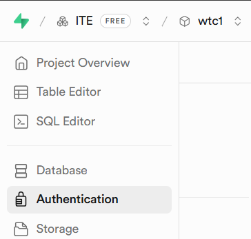
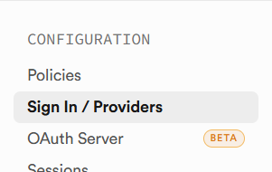
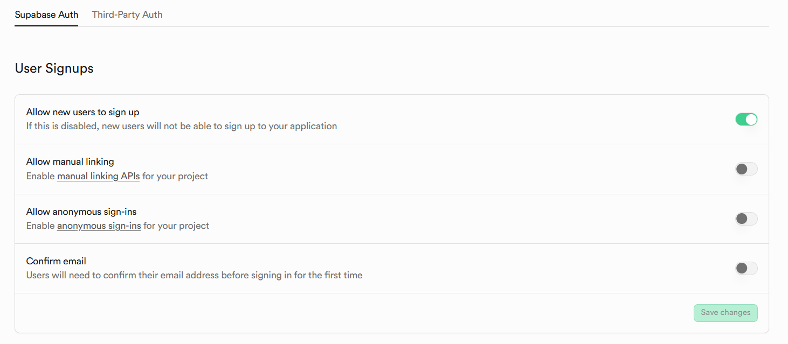

Lab – ReactJS part 2
=  
## Login & Register with Supabase (React + Vite)

### Step 1: Configure Supabase Authentication

For development purposes, email confirmation will be disabled.

#### Step 1.1: Open Authentication Settings
Navigate to **Authentication** in your Supabase Dashboard.  


#### Step 1.2: Open Sign-In Providers
Go to **Sign In / Providers**.  


#### Step 1.3: Disable Email Confirmation
Turn **OFF** the **Confirm email** option (development mode only).  


---

### Step 2: Configure Environment Variables
Create a file named **`.env.local`** in the root of your project.
```
VITE_SUPABASE_URL=YOUR_PROJECT_URL
VITE_SUPABASE_ANON_KEY=YOUR_ANON_KEY_HERE 

```

Replace `YOUR_PROJECT_URL` with your **Project url ** from the Supabase Dashboard.
Replace `YOUR_ANON_KEY_HERE` with your **Publishable key ** from the Supabase Dashboard.

### Step 3: Setup Supabase Client in your project by Install Dependencies
`npm install @supabase/supabase-js react-router-dom`

---

### Step 4: Create Supabase Client
Create a Supabase client to connect your app.

**File:** `src/lib/supabaseClient.js`

```
import { createClient } from "@supabase/supabase-js";

const SUPABASE_URL = import.meta.env.VITE_SUPABASE_URL;
const SUPABASE_ANON_KEY = import.meta.env.VITE_SUPABASE_ANON_KEY;

export const supabase = createClient(SUPABASE_URL, SUPABASE_ANON_KEY);
```

---

### Step 5: App Component & Session Management
**In File:** `src/main.jsx`
```
import React from "react";
import ReactDOM from "react-dom/client";
import { BrowserRouter } from "react-router-dom";
import App from "./App.jsx";
import "./index.css";

ReactDOM.createRoot(document.getElementById("root")).render(
  <React.StrictMode>
    <BrowserRouter>
      <App />
    </BrowserRouter>
  </React.StrictMode>
);

```

**In File:** `src/App.jsx`
```
import { useEffect, useState } from "react";
import { Routes, Route } from "react-router-dom";
import { supabase } from "./lib/supabaseClient";
import Navbar from "./components/Navbar";
import Footer from "./components/Footer";
import HomePage from "./pages/HomePage";
import LoginPage from "./pages/LoginPage";
import RegisterPage from "./pages/RegisterPage";

export default function App() {
  const [user, setUser] = useState(null);
  const [checkingSession, setCheckingSession] = useState(true);

  useEffect(() => {
    async function checkSession() {
      const { data } = await supabase.auth.getSession();
      setUser(data?.session?.user || null);
      setCheckingSession(false);
    }

    checkSession();
  }, []);

  async function handleLogout() {
    await supabase.auth.signOut();
    setUser(null);
  }

  function handleLoginSuccess(loggedInUser) {
    setUser(loggedInUser);
  }

  if (checkingSession) {
    return (
      <div className="min-h-screen flex items-center justify-center">
        <p className="text-gray-600">Checking session...</p>
      </div>
    );
  }

  return (
    <div className="flex flex-col min-h-screen bg-gray-50">
      <Navbar user={user} onLogout={handleLogout} />

      <main className="flex-1 container mx-auto px-4 py-6">
        <Routes>
          <Route path="/" element={<HomePage user={user} />} />
          <Route
            path="/login"
            element={<LoginPage onLoginSuccess={handleLoginSuccess} />}
          />
          <Route path="/register" element={<RegisterPage />} />
        </Routes>
      </main>

      <Footer />
    </div>
  );
}
```

---

### Step 6. Implement Register Page (sign up)
To allows users to create a new account.

**File:** `src/pages/RegisterPage.jsx`

```
import { useState } from "react";
import { useNavigate } from "react-router-dom";
import { supabase } from "../lib/supabaseClient";

export default function RegisterPage() {
  const [email, setEmail] = useState("");
  const [password, setPassword] = useState("");
  const [confirmPassword, setConfirmPassword] = useState("");
  const [loading, setLoading] = useState(false);
  const [error, setError] = useState(null);
  const [success, setSuccess] = useState(null);
  const navigate = useNavigate();

  async function handleRegister(e) {
    e.preventDefault();
    setError(null);
    setSuccess(null);

    // simple password checks (keep or remove as you like)
    if (password !== confirmPassword) {
      setError("Passwords do not match");
      return;
    }

    if (password.length < 6) {
      setError("Password must be at least 6 characters");
      return;
    }

    setLoading(true);

    try {
      const { error: authError } = await supabase.auth.signUp({
        email,
        password,
      });

      if (authError) {
        setError(authError.message);
      } else {
        // no "check your email" message
        setSuccess("Account created! You can log in now.");
        setEmail("");
        setPassword("");
        setConfirmPassword("");
        // optional: redirect to login quickly
        setTimeout(() => navigate("/login"), 1500);
      }
    } catch {
      setError("An unexpected error occurred. Please try again.");
    } finally {
      setLoading(false);
    }
  }

  return (
    <section className="flex-1 flex items-center justify-center bg-gray-50 px-4">
      <div className="w-full max-w-md bg-white rounded-2xl border border-gray-200 p-8">
        <h1 className="text-3xl font-bold mb-6 text-center">Register</h1>

        <form onSubmit={handleRegister} className="space-y-4">
          <input
            type="email"
            value={email}
            disabled={loading}
            onChange={(e) => setEmail(e.target.value)}
            placeholder="Email"
            required
            className="w-full px-4 py-2 border border-gray-300 rounded-lg focus:outline-none focus:ring-2 focus:ring-blue-600"
          />

          <input
            type="password"
            value={password}
            disabled={loading}
            onChange={(e) => setPassword(e.target.value)}
            placeholder="Password"
            required
            className="w-full px-4 py-2 border border-gray-300 rounded-lg focus:outline-none focus:ring-2 focus:ring-blue-600"
          />

          <input
            type="password"
            value={confirmPassword}
            disabled={loading}
            onChange={(e) => setConfirmPassword(e.target.value)}
            placeholder="Confirm Password"
            required
            className="w-full px-4 py-2 border border-gray-300 rounded-lg focus:outline-none focus:ring-2 focus:ring-blue-600"
          />

          {error && (
            <p className="text-red-600 mb-1 text-sm">
              {error}
            </p>
          )}

          {success && (
            <p className="text-green-600 mb-1 text-sm">
              {success}
            </p>
          )}

          <button
            type="submit"
            disabled={loading}
            className="w-full bg-blue-600 text-white py-2 rounded-lg hover:bg-blue-500 disabled:bg-gray-400"
          >
            {loading ? "Creating account..." : "Register"}
          </button>
        </form>

        <p className="mt-4 text-center text-sm">
          Already have an account?{" "}
          <a href="/login" className="text-blue-600 hover:underline">
            Login
          </a>
        </p>
      </div>
    </section>
  );
}

```

### Step 7. Implement Login Page (sign in)
To allows registered users to log in.

**File:** `src/pages/LoginPage.jsx`
```
import { useState } from "react";
import { Link, useNavigate } from "react-router-dom";
import { supabase } from "../lib/supabaseClient";

export default function LoginPage({ onLoginSuccess }) {
  const [email, setEmail] = useState("");        // form state
  const [password, setPassword] = useState("");
  const [loading, setLoading] = useState(false); // loading state
  const [error, setError] = useState(null);      // error message state

  const navigate = useNavigate();

  async function handleLogin(e) {
    e.preventDefault();
    setError(null);
    setLoading(true);

    try {
      const { data, error: authError } =
        await supabase.auth.signInWithPassword({
          email,
          password,
        });

      if (authError) {
        console.error("Supabase auth error:", authError);
        setError(authError.message);
      return;

      } else {
        // login success → save user in App and go Home
        onLoginSuccess(data.user);
        navigate("/");
      }
    } catch {
      setError("An unexpected error occurred. Please try again.");
    } finally {
      setLoading(false);
    }
  }

  return (
    <section className="flex-1 flex items-center justify-center bg-gray-50 px-4">
      <div className="w-full max-w-md bg-white rounded-2xl border border-gray-200 p-8">
        {/* Title */}
        <h2 className="text-3xl font-bold text-center text-gray-800 mb-1">
          Welcome Back
        </h2>
        <p className="text-center text-sm text-gray-500 mb-4">
          Login to your account
        </p>

        

        {/* Form */}
        <form className="space-y-5" onSubmit={handleLogin}>
          {/* Email */}
          <div>
            <label className="block text-sm font-medium text-gray-700 mb-1">
              Email Address
            </label>
            <input
              type="email"
              placeholder="you@example.com"
              value={email}
              disabled={loading}
              onChange={(e) => setEmail(e.target.value)}
              required
              className="w-full rounded-lg border border-gray-300 px-4 py-2.5 text-sm
                         placeholder-gray-400
                         focus:outline-none focus:ring-2 focus:ring-blue-600 focus:border-blue-600"
            />
          </div>

          {/* Password */}
          <div>
            <label className="block text-sm font-medium text-gray-700 mb-1">
              Password
            </label>
            <input
              type="password"
              placeholder="••••••••"
              value={password}
              disabled={loading}
              onChange={(e) => setPassword(e.target.value)}
              required
              className="w-full rounded-lg border border-gray-300 px-4 py-2.5 text-sm
                         placeholder-gray-400
                         focus:outline-none focus:ring-2 focus:ring-blue-600 focus:border-blue-600"
            />
          </div>

          {/* Error */}
          {error && (
            <p className="mb-4 text-sm text-red-600 text-center">
              {error}
            </p>
          )}

          {/* Submit Button */}
          <button
            type="submit"
            disabled={loading}
            className="w-full rounded-lg bg-blue-600 py-2.5 text-white font-semibold
                       hover:bg-blue-700 active:scale-[0.99]
                       transition-all duration-200 disabled:bg-gray-400"
          >
            {loading ? "Signing in..." : "Sign In"}
          </button>
        </form>

        {/* Footer */}
        <p className="mt-6 text-center text-sm text-gray-600">
          Don&apos;t have an account?{" "}
          <Link
            to="/register"
            className="font-medium text-blue-600 hover:underline"
          >
            Register
          </Link>
        </p>
      </div>
    </section>
  );
}
```

---

### Step 8: Navbar with Authentication State and Footer
The Navbar updates based on login status.

**File:** `src/components/Navbar.jsx`

```
import { Link, useLocation } from "react-router-dom";

export default function Navbar({ user, onLogout }) {
  const location = useLocation();

  const linkClass =
    "px-3 py-2 rounded-md text-sm font-medium hover:bg-gray-100";

  const activeClass =
    "px-3 py-2 rounded-md text-sm font-semibold bg-blue-600 text-white";

  return (
    <header className="bg-white shadow">
      <nav className="container mx-auto flex items-center justify-between px-4 py-5">

        {/* Logo */}
        <Link to="/" className="text-xl font-bold text-blue-600">
          MyReactApp
        </Link>

        {/* Right side */}
        <div className="flex items-center gap-4">

          {/* Left group: navigation links */}
          <div className="flex gap-2">
            <Link
              to="/"
              className={location.pathname === "/" ? activeClass : linkClass}
            >
              Home
            </Link>

            {!user && (
              <Link
                to="/register"
                className={
                  location.pathname === "/register" ? activeClass : linkClass
                }
              >
                Register
              </Link>
            )}

            <div className="border" />

            {!user && (
              <Link
                to="/login"
                className={
                  location.pathname === "/login" ? activeClass : linkClass
                }
              >
                Login
              </Link>
            )}

            {/* Right group: user info / logout */}
            {user && (
              <div>
                <button
                  onClick={onLogout}
                  className="px-3 py-2 rounded-md text-sm font-semibold bg-red-600 text-white hover:bg-red-500"
                >
                  Logout
                </button>
              </div>
            )}
          </div>
        </div>
      </nav>
    </header>
  );
}
```

**File:** `src/components/Footer.jsx`
```
export default function Footer() {
  return (
    <footer>
      <div className="max-w-6xl mx-auto px-4 py-6 flex items-center justify-center">
        <p className="text-sm ">
          © {new Date().getFullYear()} MyReactSite. All rights reserved.
        </p>
      </div>
    </footer>
  );
}
```

---
### Step 9: Make a component Dashboard
Create component dashboard for can call it to use any layer
**Files:** `src/components/DashboardComponents.jsx`
```
export function StatCard({ title, value, color = "text-blue-600" }) {
  return (
    <div className="bg-white rounded-xl border shadow-sm p-5">
      <p className="text-sm text-gray-500">{title}</p>
      <p className={`text-3xl font-bold mt-2 ${color}`}>{value}</p>
    </div>
  );
}

export function TableRow({ id, name, status }) {
  const statusColor =
    status === "Active"
      ? "text-green-600"
      : status === "Pending"
      ? "text-yellow-600"
      : "text-red-600";

  return (
    <tr>
      <td className="px-6 py-3">{id}</td>
      <td className="px-6 py-3">{name}</td>
      <td className={`px-6 py-3 font-medium ${statusColor}`}>
        {status}
      </td>
    </tr>
  );
}
```


### Step 10: Home Page & Dashboard Component
Displays different content depending on authentication status.

**File:** `src/pages/HomePage.jsx`

```import profilePic from "../assets/profile.jpg";
import StemBuilding from "../assets/stem.jpeg";
import { StatCard, TableRow } from "../components/DashboardComponents";

export default function HomePage({ user }) {
  // ================= DASHBOARD =================
  if (user) {
    return (
      <main className="bg-gray-50">
        <div className="max-w-6xl mx-auto space-y-8">

          {/* Header */}
          <div className="flex items-center justify-between bg-white p-6 rounded-2xl shadow-sm border">
            <div>
              <h1 className="text-2xl md:text-3xl font-bold text-gray-800">
                Dashboard
              </h1>
              <p className="text-sm text-gray-500 mt-1">
                Welcome back,{" "}
                <span className="font-medium">{user.email}</span>
              </p>
            </div>

            <div className="w-12 h-12 rounded-full bg-gray-600 text-white flex items-center justify-center font-semibold text-lg shadow-sm">
              {user.email.charAt(0).toUpperCase()}
            </div>
          </div>

          {/* Stats */}
          <div className="grid grid-cols-1 sm:grid-cols-2 lg:grid-cols-4 gap-4">
            <StatCard title="Total Projects" value="12" />
            <StatCard title="Active" value="8" color="text-green-600" />
            <StatCard title="Pending" value="3" color="text-yellow-600" />
            <StatCard title="Inactive" value="1" color="text-red-600" />
          </div>

          {/* Table */}
          <div className="bg-white rounded-2xl shadow-sm border overflow-hidden">
            <div className="px-6 py-4 border-b flex items-center justify-between">
              <h2 className="text-lg font-semibold text-gray-800">
                Project Overview
              </h2>
              <span className="text-xs text-gray-500 uppercase">
                Sample Data
              </span>
            </div>

            <div className="overflow-x-auto">
              <table className="min-w-full text-sm">
                <thead className="bg-gray-50 text-gray-600">
                  <tr>
                    <th className="px-6 py-3 text-left font-medium">ID</th>
                    <th className="px-6 py-3 text-left font-medium">Name</th>
                    <th className="px-6 py-3 text-left font-medium">Status</th>
                  </tr>
                </thead>
                <tbody className="divide-y">
                  <TableRow id="1" name="Sample Item A" status="Active" />
                  <TableRow id="2" name="Sample Item B" status="Pending" />
                  <TableRow id="3" name="Sample Item C" status="Inactive" />
                </tbody>
              </table>
            </div>
          </div>

        </div>
      </main>
    );
  }

  // ================= PUBLIC PAGE =================
  return (
    <main className="flex-1 flex flex-col items-center justify-center space-y-6">
      <section className="flex text-start px-4 space-x-4">
        
        <div className="space-y-4">
          <h1 className="text-4xl md:text-5xl font-bold">
            Welcome to My React Site
          </h1>
          <p className="text-lg md:text-xl">
            Hello! I'm learning{" "}
            <span className="font-semibold text-blue-600">React</span>.
          </p>
        </div>
      </section>

      
    </main>
  );
}
```
---


**Note: please follow previous lab to install tailwindcss and react-router** 
- Install Tailwind CSS `npm install tailwindcss @tailwindcss/vite`
- Install react-router `npm install react-router-dom`